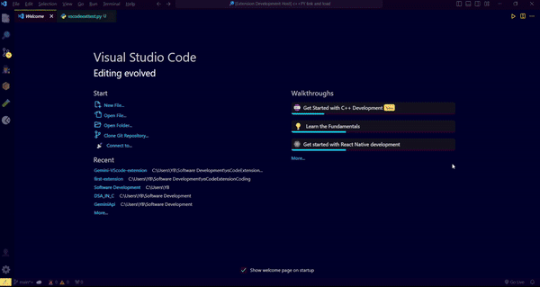

# Gemini Chat - VSCode Extension

Gemini Chat is a VSCode extension that allows you to seamlessly interact with the Gemini API directly from your code editor. With Gemini Chat, you can quickly generate code snippets, stories, business ideas, and more, all without leaving your development environment.

## Features

- **Generate Code**: Quickly generate unique code snippets for various purposes.
- **Generate Story**: Get creative inspiration by generating random story prompts.
- **Generate Idea**: Explore unique business ideas generated on-the-fly.
- **Generate Money**: Receive suggestions on how to make money through various means.
- **Generate Anything**: Receive content based on your prompt.

## Installation

You can install Gemini Chat directly from the Visual Studio Code Marketplace or by searching for "Gemini Chat" in the Extensions view (Ctrl+Shift+X) within VSCode.

## Usage

Once installed, simply open the command palette (Ctrl+Shift+P) and type "**Open Gemini Chat**" || "**Hello Gemini Chatbot**" || "**GEMINI**" to access the available commands. You can also use the provided snippets directly in your code by invoking them from the IntelliSense suggestions.

**Advice**

Assign a shortcut key of your prefrences to Gemini Chat to Access Easily. We suggest   [**Alt+G**](#)  by default this combiniation is undefined to any Feature in Vs code.

## Security
Your **API KEY** is stored in your local storage and is not sent to any data base. As long as this project is **open source** there is no risk of using it and none of your **Activity** is monitored.
## Getting Started

1. **Install the Extension**: Install Gemini Chat from the VSCode Marketplace.
2. **Authenticate**: For the first time You are required to provide your Gemini API key through the settings ⚙️ panel aviliable in top right corner of **Gemini Chat** window.
3. **Start Chatting**: Open the command palette and start chatting with Gemini to generate various snippets and ideas.

## Configuration

Gemini Chat  require you to authenticate with your Gemini **API KEY**. You can do this by accessing the extension settings through the Gear ⚙️ icon  directly from the Gemini Chat View .

You can Click on ***GET API KEY*** on the on the setting of ***Gemini Chat view*** or [Click here](https://aistudio.google.com/app/apikey) .

You can visit [Google Ai Studio](https://aistudio.google.com/) to Get Your own **API KEY**.

## Feedback

We welcome your feedback! If you encounter any issues, have suggestions for improvements, or want to contribute to the project, please feel free to open an issue or submit a pull request on the [GitHub repository](https://github.com/YadavBinay/gemini-api-vscode-ext).

## License

This project is licensed under the [MIT License](LICENSE).

## Acknowledgements

Gemini Chat is powered by the Google Generative AI API. Special thanks to the developers of the API for making this project possible.

## Contributors

- [YadaV BinaY](https://github.com/YadavBinay) - Creator and maintainer

## Support

For any inquiries or assistance, please contact [binayyadavofficial@gmail.com](mailto:binayyadavofficial@gmail.com).

---

### Enjoy Chatting with Gemini! 🚀 🤖 👽
